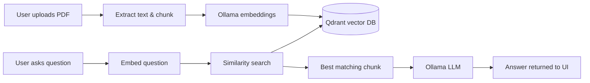

# PDF Chat-Bot

A full-stack **Retrieval-Augmented Generation (RAG)** application that lets you upload a PDF and ask questions about its content. The backend extracts text, creates embeddings with Ollama, stores vectors in Qdrant, and generates answers with a local LLM. The React frontend provides a chat-style interface for upload and Q&A.

---

## Features

- **PDF upload** — drag-and-drop or file picker
- **Automatic indexing** — text is chunked, embedded, and stored in a Qdrant vector collection
- **Grounded Q&A** — answers are generated only from retrieved document context
- **Chat UI** — message history, loading states, and similarity scores
- **Fully local** — runs with Ollama and Qdrant on your machine (no external API keys required)

---

## How It Works



1. **Upload** — the PDF is parsed with `pdf-parse` and split into paragraph chunks.
2. **Embed** — each chunk is converted to a 768-dimensional vector using Ollama (`embeddinggemma`).
3. **Store** — vectors and text payloads are upserted into the `pdf-docs` collection in Qdrant.
4. **Ask** — the user's question is embedded, the closest chunk is retrieved, and the LLM (`qwen3:4b`) generates an answer from that context only.

---

## Tech Stack

| Layer | Technologies |
|-------|--------------|
| **Frontend** | React 19, Vite, Tailwind CSS v4, React Icons |
| **Backend** | Node.js, Express 5, Multer, pdf-parse |
| **AI / RAG** | LangChain Ollama (`@langchain/ollama`) |
| **Embeddings** | Ollama — `embeddinggemma` |
| **Generation** | Ollama — `qwen3:4b` |
| **Vector DB** | Qdrant (`@qdrant/js-client-rest`) |

---

## Prerequisites

Before running the project, install and start:

| Service | Purpose | Default URL |
|---------|---------|-------------|
| [Node.js](https://nodejs.org/) (v18+) | Backend & frontend runtime | — |
| [Ollama](https://ollama.com/) | Embeddings + LLM | `http://127.0.0.1:11434` |
| [Qdrant](https://qdrant.tech/) | Vector storage & search | `http://127.0.0.1:6333` |

### Pull required Ollama models

```bash
ollama pull embeddinggemma
ollama pull qwen3:4b
ollama serve
```

### Start Qdrant

Using Docker:

```bash
docker run -p 6333:6333 -p 6334:6334 qdrant/qdrant
```

Or run Qdrant locally if you already have it installed.

---

## Project Structure

```
rag-app/
├── backend/
│   ├── src/
│   │   ├── server.js              # Express app & API routes
│   │   └── services/
│   │       ├── embeddings.js      # Ollama embedding model
│   │       ├── generationModel.js # Ollama chat model
│   │       └── qdrant.js          # Qdrant client
│   ├── uploads/                   # Temporary PDF uploads (gitignored)
│   ├── .env.example
│   └── package.json
│
├── rag-frontend/
│   ├── src/
│   │   ├── components/            # Navbar, UploadBox, ChatWindow, etc.
│   │   ├── pages/home.jsx         # Main app page
│   │   └── services/api.js        # Backend API client
│   ├── vite.config.js
│   └── package.json
│
└── README.md
```

---

## Getting Started

### 1. Clone the repository

```bash
git clone <your-repo-url>
cd rag-app
```

### 2. Start the backend

```bash
cd backend
npm install
npm start
```

The API will be available at **http://localhost:3000**.

For development with auto-reload:

```bash
npm run dev
```

### 3. Start the frontend

In a new terminal:

```bash
cd rag-frontend
npm install
npm run dev
```

The app will open at **http://localhost:5173**.

### 4. Use the app

1. Open the frontend in your browser.
2. Upload a PDF — this creates a fresh `pdf-docs` collection and indexes the document.
3. Ask questions in the chat — answers are generated from retrieved PDF context.

---

## API Reference

Base URL: `http://localhost:3000`

### Health check

```http
GET /
```

**Response**

```json
{
  "success": true,
  "message": "RAG Backend Running 🚀"
}
```

---

### Create vector collection

Creates (or recreates) the `pdf-docs` collection in Qdrant. Called automatically by the frontend before each upload.

```http
GET /create-document
```

**Response**

```json
{
  "success": true,
  "message": "collection created",
  "collection": "pdf-docs"
}
```

---

### Upload & index PDF

```http
POST /upload
Content-Type: multipart/form-data
```

| Field | Type | Required | Description |
|-------|------|----------|-------------|
| `pdf` | file | Yes | PDF file to index |
| `question` | string | No | Optional — index and answer in one request |

**Example (curl)**

```bash
curl -X POST http://localhost:3000/upload \
  -F "pdf=@/path/to/document.pdf"
```

**Response**

```json
{
  "success": true,
  "message": "PDF indexed successfully",
  "total_chunks": 42,
  "filename": "document.pdf"
}
```

---

### Ask a question

```http
POST /ask
Content-Type: application/json
```

**Request body**

```json
{
  "question": "What is the main topic of this document?"
}
```

**Response**

```json
{
  "question": "What is the main topic of this document?",
  "answer": "The document discusses ...",
  "matched_chunk": "Relevant paragraph from the PDF ...",
  "similarity_score": 0.87
}
```

If no relevant context is found, the answer will be `"i don't know."`.

---

## Configuration

### Backend models

Models are configured in `backend/src/services/`:

| File | Setting | Default |
|------|---------|---------|
| `embeddings.js` | Embedding model | `embeddinggemma` |
| `embeddings.js` | Ollama URL | `http://127.0.0.1:11434` |
| `generationModel.js` | Chat model | `qwen3:4b` |
| `generationModel.js` | Temperature | `0` |
| `qdrant.js` | Qdrant host | `127.0.0.1:6333` |

### Frontend API URL

By default the frontend calls `http://localhost:3000`. To override, create `rag-frontend/.env`:

```env
VITE_API_URL=http://localhost:3000
```

During development, Vite also proxies `/create-document`, `/upload`, and `/ask` to the backend (see `rag-frontend/vite.config.js`).

---

## Scripts

### Backend (`backend/`)

| Command | Description |
|---------|-------------|
| `npm start` | Start the API server |
| `npm run dev` | Start with nodemon (auto-reload) |

### Frontend (`rag-frontend/`)

| Command | Description |
|---------|-------------|
| `npm run dev` | Start Vite dev server |
| `npm run build` | Production build |
| `npm run preview` | Preview production build |
| `npm run lint` | Run Oxlint |

---

## Troubleshooting

| Issue | Likely cause | Fix |
|-------|--------------|-----|
| `Could not process PDF embeddings` | Ollama not running or model missing | Run `ollama serve` and pull `embeddinggemma` |
| `Could not create collection` | Qdrant not running | Start Qdrant on port `6333` |
| `Could not answer question` | Chat model unavailable | Pull `qwen3:4b` with Ollama |
| `No readable text was found on the pdf` | Scanned/image-only PDF | Use a PDF with selectable text |
| Frontend can't reach backend | CORS or wrong port | Ensure backend is on `:3000` and CORS is enabled |
| Empty or wrong answers | Weak chunk match | Try rephrasing the question; only the top-1 chunk is used |

---

## Limitations

- Only **one PDF session** at a time — uploading a new PDF recreates the collection.
- Chunking uses **double-newline paragraph splits** — complex layouts may not chunk optimally.
- Retrieval uses **top-1 similarity search** — no reranking or multi-chunk context yet.
- Requires **locally running** Ollama and Qdrant — not configured for cloud deployment out of the box.

---

## License

ISC
